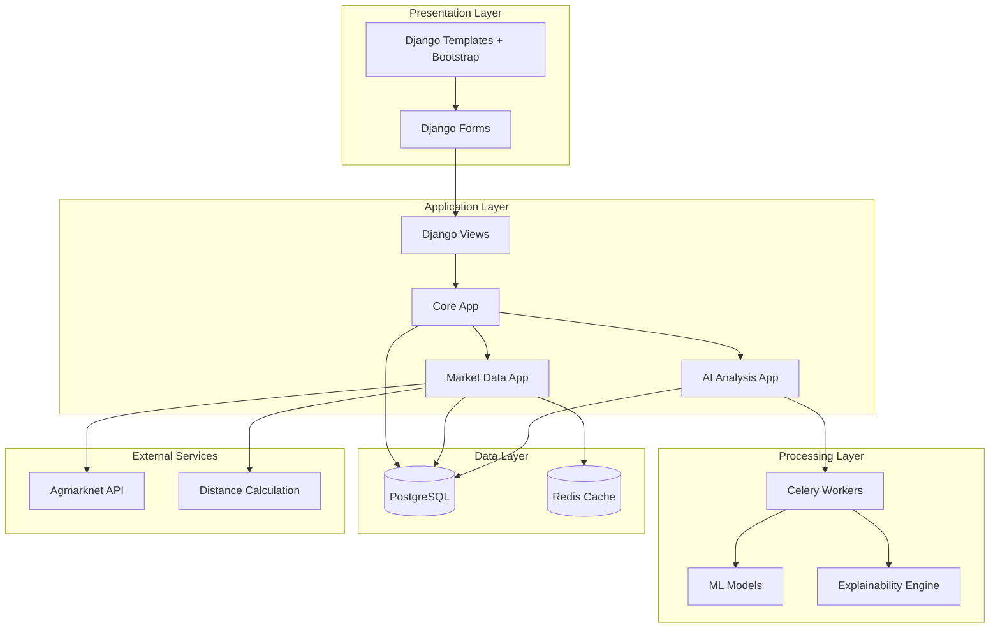
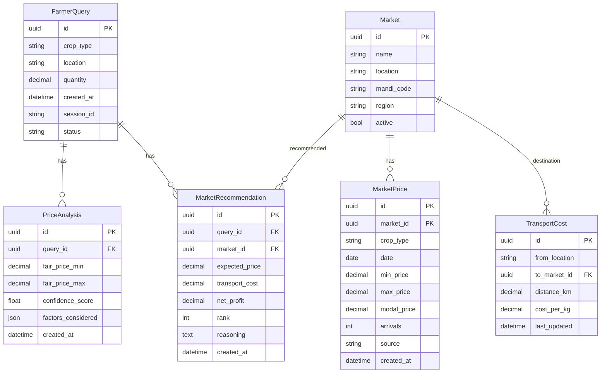

# Design Document: Farmer Market Advisor

## Overview

The Farmer Market Advisor is a Django web application that provides AI-powered market intelligence to small and marginal farmers. The system integrates real-time market data from government sources (primarily Agmarknet), applies machine learning models for price prediction and market analysis, and presents recommendations with transparent explainability.

The architecture follows Django's MVT (Model-View-Template) pattern with three core Django apps:
1. **core**: User input handling, session management, and main workflows
2. **market_data**: Integration with external market data sources and caching
3. **ai_analysis**: Machine learning models, price prediction, and explainability

The system uses Celery for asynchronous processing of AI analysis tasks, Redis for caching market data and as a Celery message broker, and PostgreSQL for persistent storage.

## Architecture

### High-Level Architecture



### Django App Structure

```
farmer_market_advisor/
├── config/                      # Django project settings
│   ├── settings.py
│   ├── urls.py
│   └── celery.py
├── core/                        # Core app - user workflows
│   ├── models.py               # FarmerQuery, QueryHistory
│   ├── views.py                # Main views
│   ├── forms.py                # Input forms
│   ├── urls.py
│   └── templates/
├── market_data/                 # Market data integration
│   ├── models.py               # MarketPrice, Market, TransportCost
│   ├── services.py             # Data fetching services
│   ├── adapters.py             # External API adapters
│   └── cache.py                # Caching logic
├── ai_analysis/                 # AI/ML engine
│   ├── models.py               # AIRecommendation, PriceAnalysis
│   ├── ml_models.py            # ML model definitions
│   ├── tasks.py                # Celery tasks
│   ├── explainer.py            # Explainability logic
│   └── predictor.py            # Price prediction logic
└── static/                      # CSS, JS, images
```

## Components and Interfaces

### 1. Core App Components

**FarmerQuery Model**:
```python
class FarmerQuery:
    id: UUID
    crop_type: str
    location: str (latitude, longitude or place name)
    quantity: Decimal (in kg or quintals)
    created_at: datetime
    session_id: str
    status: str (pending, processing, completed, failed)
```

**QueryInputForm**:
- Validates crop type against supported crops
- Validates quantity is positive
- Validates location format
- Provides user-friendly error messages

**MainView**:
- Renders input form
- Handles form submission
- Triggers async AI analysis via Celery
- Displays results when ready

### 2. Market Data App Components

**Market Model**:
```python
class Market:
    id: UUID
    name: str
    location: str (latitude, longitude)
    mandi_code: str (Agmarknet identifier)
    region: str
    active: bool
```

**MarketPrice Model**:
```python
class MarketPrice:
    id: UUID
    market: ForeignKey(Market)
    crop_type: str
    date: date
    min_price: Decimal
    max_price: Decimal
    modal_price: Decimal
    arrivals: int (quantity arrived at market)
    source: str (data source identifier)
    created_at: datetime
```

**TransportCost Model**:
```python
class TransportCost:
    id: UUID
    from_location: str
    to_market: ForeignKey(Market)
    distance_km: Decimal
    cost_per_kg: Decimal
    last_updated: datetime
```

**AgmarknetAdapter**:
- Fetches data from data.gov.in Agmarknet API
- Parses CSV/JSON responses
- Handles API errors and timeouts
- Returns standardized MarketPrice objects

**MarketDataService**:
- Orchestrates data collection from multiple sources
- Implements caching strategy (Redis with 1-hour TTL for real-time, 24-hour for historical)
- Calculates transport costs using distance and standard rates
- Provides clean interface for AI analysis app

### 3. AI Analysis App Components

**PriceAnalysis Model**:
```python
class PriceAnalysis:
    id: UUID
    query: ForeignKey(FarmerQuery)
    fair_price_min: Decimal
    fair_price_max: Decimal
    confidence_score: float
    factors_considered: JSONField
    created_at: datetime
```

**MarketRecommendation Model**:
```python
class MarketRecommendation:
    id: UUID
    query: ForeignKey(FarmerQuery)
    market: ForeignKey(Market)
    expected_price: Decimal
    transport_cost: Decimal
    net_profit: Decimal
    rank: int
    reasoning: TextField
    created_at: datetime
```

**PricePredictor**:
- Uses ensemble approach: ARIMA for time series + Random Forest for feature-based prediction
- ARIMA captures seasonal trends and historical patterns
- Random Forest incorporates regional demand, transport costs, and market-specific factors
- Combines predictions with weighted average based on data availability
- Returns price range (min, max) with confidence score

**MarketAnalyzer**:
- Calculates net profit for each market: (expected_price * quantity) - (transport_cost * quantity)
- Ranks markets by net profit
- Filters out markets with negative net profit
- Returns top N recommendations (default: 5)

**ExplainabilityEngine**:
- Uses SHAP (SHapley Additive exPlanations) for feature importance
- Generates human-readable explanations from SHAP values
- Identifies top 3-5 factors influencing each recommendation
- Formats explanations in simple language avoiding technical jargon
- Example output: "This price is recommended because: (1) Historical prices in your region averaged ₹25/kg in the last month, (2) Current demand is high due to festival season, (3) Transport costs to this market are low"

**AnalysisTask (Celery)**:
- Async task triggered when farmer submits query
- Collects market data via MarketDataService
- Runs PricePredictor to get fair price range
- Runs MarketAnalyzer to get market recommendations
- Runs ExplainabilityEngine for each recommendation
- Stores results in database
- Updates query status to completed

## Data Models

### Entity Relationship Diagram



### Database Constraints

- FarmerQuery.quantity > 0
- PriceAnalysis.fair_price_min <= PriceAnalysis.fair_price_max
- PriceAnalysis.confidence_score BETWEEN 0 AND 1
- MarketRecommendation.rank > 0
- MarketPrice.min_price <= MarketPrice.modal_price <= MarketPrice.max_price
- TransportCost.distance_km >= 0
- TransportCost.cost_per_kg >= 0


## Correctness Properties

A property is a characteristic or behavior that should hold true across all valid executions of a system—essentially, a formal statement about what the system should do. Properties serve as the bridge between human-readable specifications and machine-verifiable correctness guarantees.

### Property 1: Input Validation Consistency

*For any* farmer input, the form validation should accept the input if and only if all required fields are present, the crop type is in the supported list, and the quantity is positive.

**Validates: Requirements 1.2, 1.3**

### Property 2: Price Range Invariant

*For any* calculated fair price range, the minimum price must be less than or equal to the maximum price.

**Validates: Requirements 3.4**

### Property 3: Net Profit Calculation Correctness

*For any* market recommendation with expected price, quantity, and transport cost, the net profit must equal (expected_price * quantity) - (transport_cost * quantity).

**Validates: Requirements 4.2**

### Property 4: Market Ranking Order

*For any* list of market recommendations, the recommendations must be sorted in descending order by net profit.

**Validates: Requirements 4.3**

### Property 5: Complete Data Collection

*For any* valid farmer query, the system should attempt to retrieve real-time prices, historical prices, transport costs, and demand indicators for the specified crop and location.

**Validates: Requirements 2.1, 2.2, 2.3, 2.4**

### Property 6: Recommendation Explainability Completeness

*For any* generated recommendation (price analysis or market recommendation), the system must produce an associated explainability report that includes reasoning and references to data sources.

**Validates: Requirements 5.1, 5.2, 5.3, 5.4**

### Property 7: Query Persistence Completeness

*For any* submitted farmer query, the stored database record must include the submission date, crop type, location, quantity, and all generated recommendations.

**Validates: Requirements 7.1, 7.5**

### Property 8: Historical Data Retrieval Consistency

*For any* farmer session or account, retrieving query history should return all previously submitted queries with their original recommendations unchanged.

**Validates: Requirements 7.2, 7.3**

### Property 9: Session Association

*For any* farmer query, the query must be associated with a valid session identifier or user account.

**Validates: Requirements 7.4**

### Property 10: Error Handling and Logging

*For any* error that occurs during processing (AI analysis, data retrieval, transport calculation), the system must log the error with sufficient debugging information and display a user-friendly message without technical details.

**Validates: Requirements 8.2, 8.3, 8.4**

### Property 11: API Failure Resilience

*For any* external API call that fails or times out, the system must continue processing with available data sources or cached data and inform the user about data limitations.

**Validates: Requirements 2.5, 8.1**

### Property 12: Cache Effectiveness

*For any* market data request, if the same data was requested within the cache TTL period, the system should return cached data without making a new external API call.

**Validates: Requirements 2.6**

### Property 13: Confidence Score Presence

*For any* AI-generated recommendation, the system must include a confidence score between 0 and 1.

**Validates: Requirements 11.4**

### Property 14: Incomplete Data Handling

*For any* market data input with missing or null fields, the AI engine must either use reasonable defaults or indicate uncertainty in the confidence score without crashing.

**Validates: Requirements 11.6**

### Property 15: Market Data Persistence with Metadata

*For any* retrieved market data, the stored database record must include timestamps, source identifiers, and all price fields (min, max, modal).

**Validates: Requirements 12.2, 12.3**

### Property 16: Market Data Validation

*For any* market price data being processed, the system must reject records where min_price > max_price or where prices are negative.

**Validates: Requirements 12.6**

### Property 17: Display Format Completeness

*For any* displayed fair price range, the output must include the currency symbol and unit of measurement (e.g., "₹25-30 per kg").

**Validates: Requirements 3.5**

### Property 18: Market Recommendation Display Completeness

*For any* displayed market recommendation, the output must include market name, expected price, transport cost, and net profit.

**Validates: Requirements 4.5**

### Property 19: Minimum Recommendations Display

*For any* query result with 3 or more profitable markets, the system must display at least the top 3 recommendations.

**Validates: Requirements 4.4**

## Error Handling

### Error Categories and Responses

**1. Input Validation Errors**:
- Invalid crop type: Display list of supported crops
- Invalid quantity: Show error message "Quantity must be greater than zero"
- Missing location: Prompt farmer to provide location
- Response: Immediate feedback, no backend processing

**2. External API Errors**:
- Agmarknet API timeout: Use cached data, display staleness warning
- Agmarknet API unavailable: Use cached data, display "Using recent data from [date]"
- Distance calculation API failure: Use default transport cost based on region, display warning
- Response: Graceful degradation, continue with available data

**3. AI Analysis Errors**:
- Insufficient historical data: Use simpler prediction model, indicate lower confidence
- Model prediction failure: Log error, display "Unable to generate recommendations at this time"
- Explainability generation failure: Provide recommendation without detailed explanation, log error
- Response: Log for debugging, display user-friendly message, update query status to failed

**4. Database Errors**:
- Connection failure: Retry with exponential backoff (3 attempts)
- Query timeout: Log error, display "System is experiencing high load, please try again"
- Constraint violation: Log error, display generic error message
- Response: Retry logic, fallback to error page

**5. Celery Task Errors**:
- Task timeout (>60 seconds): Mark query as failed, notify farmer
- Worker unavailable: Queue task for retry, display "Your request is being processed"
- Task exception: Log full traceback, update query status to failed
- Response: Retry mechanism, status updates

### Error Logging Strategy

All errors logged with:
- Timestamp
- Error type and message
- Stack trace (for exceptions)
- Request context (query ID, session ID, user agent)
- External API response (if applicable)

User-facing messages:
- No technical jargon
- Actionable guidance when possible
- Contact information for persistent issues

## Testing Strategy

### Dual Testing Approach

The system will use both unit testing and property-based testing for comprehensive coverage:

**Unit Tests**: Validate specific examples, edge cases, and error conditions
- Specific input examples (e.g., "wheat", "tomato")
- Edge cases (empty strings, boundary values)
- Error conditions (API failures, invalid data)
- Integration points between Django apps

**Property Tests**: Validate universal properties across all inputs
- Input validation across random inputs
- Price calculations across random market data
- Data persistence across random queries
- Error handling across random failure scenarios

Together, these approaches provide comprehensive coverage where unit tests catch concrete bugs and property tests verify general correctness.

### Property-Based Testing Configuration

**Library**: We will use [Hypothesis](https://hypothesis.readthedocs.io/) for Python/Django property-based testing

**Configuration**:
- Minimum 100 iterations per property test
- Each test tagged with comment referencing design property
- Tag format: `# Feature: farmer-market-advisor, Property {number}: {property_text}`
- Each correctness property implemented by a single property-based test

**Example Property Test Structure**:
```python
from hypothesis import given, strategies as st
from django.test import TestCase

class PriceRangeTests(TestCase):
    # Feature: farmer-market-advisor, Property 2: Price Range Invariant
    @given(
        min_price=st.decimals(min_value=0, max_value=10000, places=2),
        max_price=st.decimals(min_value=0, max_value=10000, places=2)
    )
    def test_price_range_invariant(self, min_price, max_price):
        # Test that calculated price range always has min <= max
        ...
```

### Test Organization

```
tests/
├── unit/
│   ├── test_forms.py           # Form validation unit tests
│   ├── test_models.py          # Model constraint unit tests
│   ├── test_views.py           # View logic unit tests
│   └── test_adapters.py        # API adapter unit tests
├── property/
│   ├── test_input_validation.py    # Property 1
│   ├── test_price_calculations.py  # Properties 2, 3, 17
│   ├── test_market_ranking.py      # Properties 4, 19
│   ├── test_data_collection.py     # Property 5
│   ├── test_explainability.py      # Property 6
│   ├── test_persistence.py         # Properties 7, 8, 9, 15
│   ├── test_error_handling.py      # Properties 10, 11, 14
│   ├── test_caching.py             # Property 12
│   ├── test_confidence_scores.py   # Property 13
│   ├── test_data_validation.py     # Property 16
│   └── test_display_format.py      # Property 18
└── integration/
    ├── test_end_to_end.py      # Full workflow tests
    └── test_celery_tasks.py    # Async task tests
```

### Testing Best Practices

- Use Django's TestCase for database-backed tests
- Use Django's TransactionTestCase for Celery task tests
- Mock external API calls in unit and property tests
- Use factory_boy for generating test data
- Run property tests with `--hypothesis-seed` for reproducibility
- Include performance benchmarks for critical paths (not as pass/fail tests)

## Implementation Notes

### Key Design Decisions

**1. ML Model Choice**: Ensemble of ARIMA + Random Forest
- ARIMA captures time series patterns and seasonality
- Random Forest handles feature-based prediction (location, demand, transport)
- Ensemble provides robustness and better accuracy than single model
- Both models are interpretable enough for explainability

**2. Async Processing**: Celery with Redis
- AI analysis can take 5-10 seconds, too long for synchronous HTTP request
- Celery provides reliable task queue with retry mechanisms
- Redis serves dual purpose: cache and message broker
- Farmers see immediate feedback with status updates

**3. Explainability**: SHAP for feature importance
- SHAP provides mathematically grounded feature importance
- Works with both ARIMA and Random Forest models
- Generates consistent explanations across different model types
- Can be translated to simple language for farmers

**4. Market Data Source**: Agmarknet via data.gov.in
- Government-provided, free, and reliable
- Covers 300+ commodities across India
- Provides min, max, and modal prices daily
- CSV/JSON API available at data.gov.in

**5. Caching Strategy**: Two-tier caching
- Real-time prices: 1-hour TTL (balance freshness and API load)
- Historical prices: 24-hour TTL (changes infrequently)
- Transport costs: 7-day TTL (relatively stable)
- Cache invalidation on explicit refresh request

**6. Distance Calculation**: Haversine formula with fallback
- Primary: Use simple Haversine distance calculation (no external API needed)
- Transport cost: Distance * standard rate per km per kg (configurable by region)
- Fallback: If location parsing fails, use regional average transport cost

### Technology Stack

- **Framework**: Django 5.0+
- **Database**: PostgreSQL 15+
- **Cache/Broker**: Redis 7+
- **Task Queue**: Celery 5+
- **ML Libraries**: scikit-learn (Random Forest), statsmodels (ARIMA), shap (explainability)
- **Frontend**: Bootstrap 5 for responsive design
- **API Client**: requests library with retry logic
- **Testing**: pytest-django, Hypothesis, factory_boy

### Security Considerations

- CSRF protection enabled (Django default)
- SQL injection prevention via Django ORM
- Input sanitization for all user inputs
- Rate limiting on API endpoints to prevent abuse
- Environment variables for sensitive configuration
- No authentication required (anonymous sessions) to reduce barriers for farmers
- Session data expires after 30 days

### Scalability Considerations

- Celery workers can be scaled horizontally
- Redis can be clustered for high availability
- Database connection pooling for efficient resource usage
- Static files served via CDN in production
- Async views for non-blocking I/O operations
- Database indexes on frequently queried fields (crop_type, date, location)
